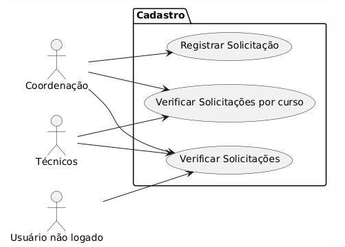
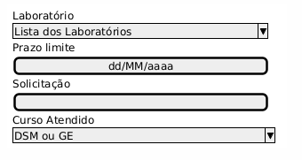

## Primeira Avaliação DESENVOLVIMENTO WEB II

## Como Realizar esta avaliação ?

1. Crie um repositório no seu github com o nome "<b>FATEC_DES_WEB2_2024_Avaliacao1</b>"

2. Publicar no Teams o repositório que será avaliado pelo professor Orlando.

##  Desafio Técnico

Os técnicos de laboratório de informática desempenham um papel essencial para garantir o funcionamento eficiente do ambiente e apoiar tanto alunos quanto professores em suas atividades. Eles são responsáveis por uma série de tarefas técnicas e administrativas que tornam possível a utilização plena dos recursos de tecnologia.

Crie um cadastro em PHP para as solicitações laboratoriais. Os coordenadores dos cursos ( DSM e Gestão Empresarial ) poderão fazer uso para formalizar as demandas docentes. Os campos que devem estar cadastrados são: 

 - Registro da solicitação, um campo texto com o que precisa ser feito.
 - Laboratório a ser feito
 - Prazo a ser atendido
 - Curso Atendido ( DSM ou GE )

Os técnicos poderão acessar o seu sistema para checar as demandas que serão atendidas. 

### 1- DashBoard - Área de login/logout (30% da nota)
- Com uso de sessões (sessions), criar uma área de login. Permitir encessar sessão (logout). Para realizar login/logout, necessário ter um único login e senha como coordenação. Estas senhas serão compartilhadas entre os coordenadores.

- Login: <b>coordenacao</b>
- Senha: <b>coordenacao</b>

Para realizar login/logout, necessário ter um único login e senha como técnicos. Estas senhas serão compartilhadas entre os coordenadores.

- Login: <b>tecnicos</b>
- Senha: <b>tecnicos</b>

### 2- Criar registro (30% da nota)
- Cadastrar os campos supracitados em arquivo texto. <b>Será possível realizar o cadastro somente em uma sessão ativa como coordenador</b>. Ao tentar cadastrar em uma sessão desativada, redirecionar para a área de login. Ao tentar cadastrar em uma sessão ativa como técnico, redirecionar para a área do painel (Dashboard).

- No arquivo texto, o padrão de gravação deve ser: Laboratório, seguido de uma barra, Data Limite , seguido de uma barra e a demanda descrita.

- As demandas para os cursos Gestão Empresarial deverão ser salvos no arquivo texto <b>ge.txt</b>.

- As demandas para os cursos Desenvolvimento em Software Multiplataforma deverão ser salvos no arquivo texto <b>dsm.txt</b>.

- Opções para a combobox laboratório.
- - Laboratório 1 
- - Laboratório 2
- - Laboratório 3

- Opções para a combobox Curso Atendido.
- - DSM
- - GE

Exemplo de conteúdo nos arquivos <b>dsm.txt</b> e <b>ge.txt</b>:
  
Laboratorio1 | 18/09/2024 | Instalar VS Code
 
Laboratorio2 | 20/09/2024 | Verificar Office instalado
  

### 3- Ler todos os registros cadastrados em determinado curso (30% da nota)
- <b>Em uma área de sessão ativa como coordenador ou técnico</b>, permitir ler todos os registros cadastrados no arquivo texto. Caso não esteja em uma sessão ativa, redirecionar para a área de login.

- Seu sistema terá um botão "Visualizar solicitações GE". Ao clicar, deve carregar uma página php, que irá acessar todos os registros do arquivo texto <b>ge.txt</b> e apresentar ao usuário logado.

- Seu sistema terá um botão "Visualizar solicitações DSM". Ao clicar, deve carregar uma página php, que irá acessar todos os registros do arquivo texto <b>dsm.txt</b> e apresentar ao usuário logado.

### 4- Ler todos os registros cadastrados (10% da nota)

- Permitir ler todos os registros cadastrados no arquivos textos.

- Seu sistema terá um botão "Visualizar todas solicitações". Ao clicar, deve carregar uma página php, que irá acessar todos os registros do arquivo texto <b>ge.txt</b>, todos os registros do arquivo texto <b>dsm.txt</b>  e apresentar ao usuário logado.

- Tecnologias: PHP Estruturado.

## Critérios de avaliação

- Entregar todos os quesitos no prazo: 100% da nota.

- Entregar todos os quesitos com atraso: 70% da nota.

- Entregar todos os quesitos fora prazo: 0% da nota.

## Prazo final

Serão considerados <b>no prazo</b> os projetos publicados até o dia 17 de setembro de 2024, 23h.

Serão considerados <b>com atraso</b> os projetos publicados até o dia 20 de setembro de 2024, 23hs.

Serão considerados <b>fora do prazo </b> os projetos publicados posterior ao prazo estipulado anteriormente.

## Considerações Finais

Você pode consultar a documentação oficial, a documentação com o Zeal, os slides e códigos do repositório da nossa sala, e até mesmo conversar com colegas de sala.  
<b>Mas</b> não é permitido copiar o código sem entender o que fez (popular cola). Ficou combinado que as atividades que forem cola serão zeradas na nota.

 
O professor publicará informes no grupo de Whatsapp abaixo:

https://chat.whatsapp.com/LvGIymKOzQc5BaetmsGmSR

